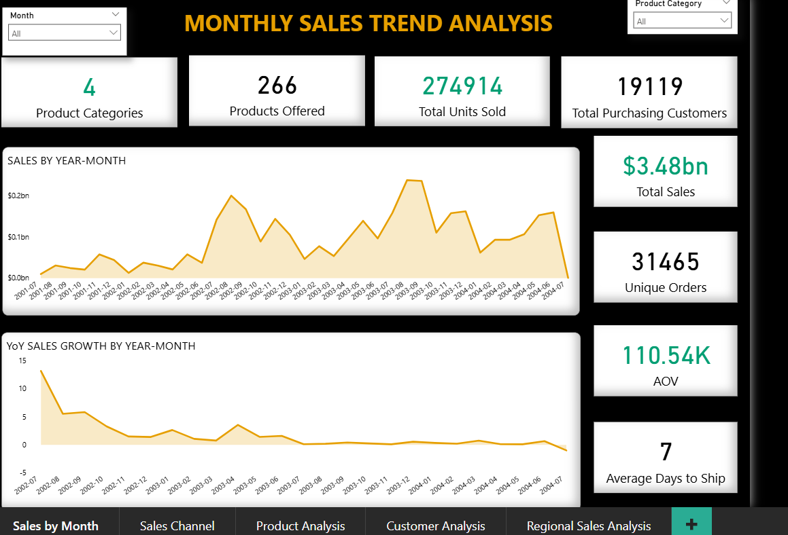
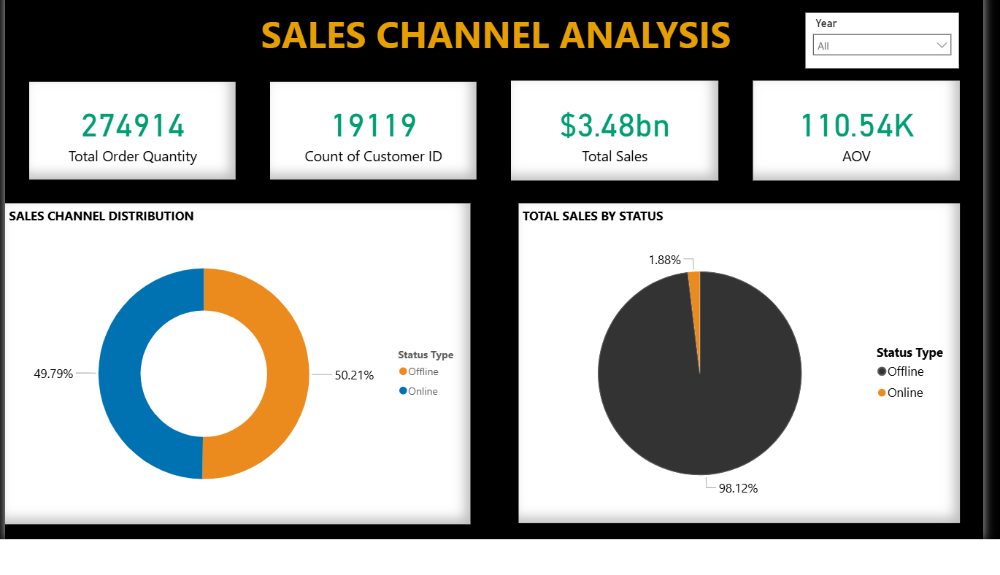
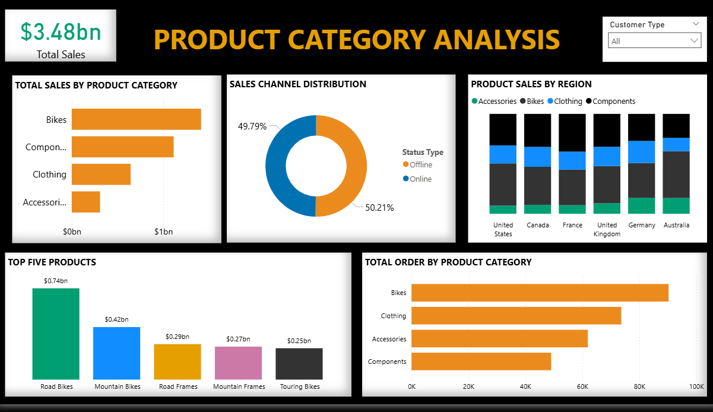
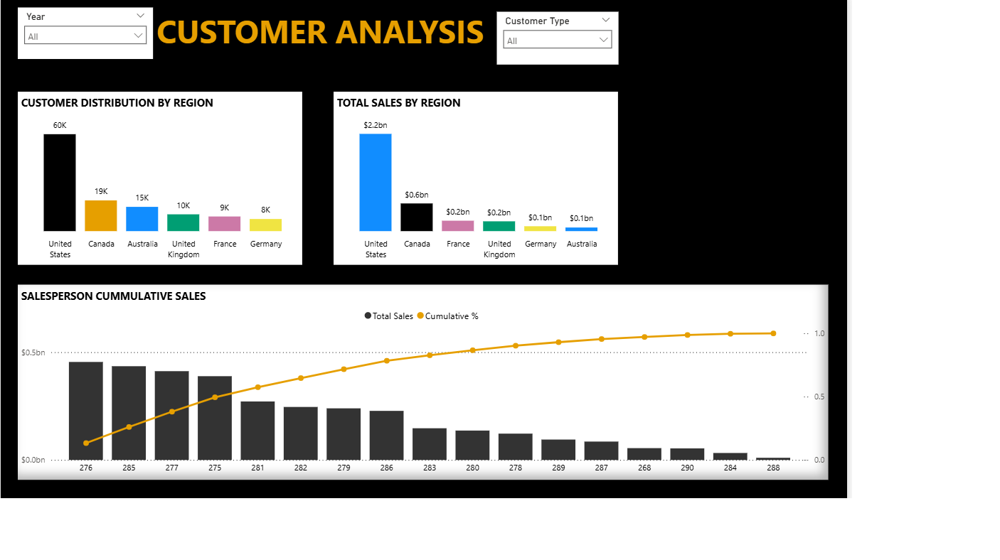
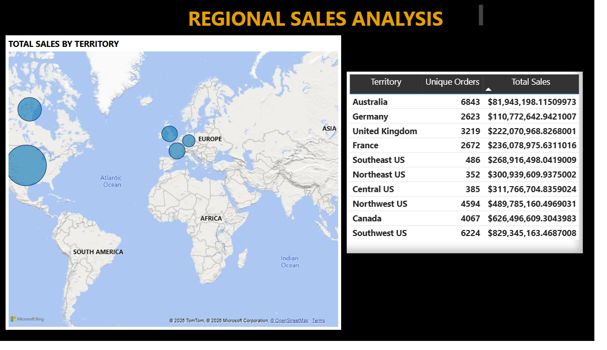

# Sales-Performance-Analysis

## Introduction:

The busyness of a business is not a guarantee that the business is doing great or is maximizing its potential. What is the data saying?

The sales performance analysis helps the business to know how they are working towards attaining their overall goal, standards to let go and which to uphold, as well as draw actionable insights for better outcome.

## Key Metrics:

1. What is the monthly sales by yearmonth?
2. What is the YOY monthly sales trend?
3. What are the sales channel and their % to overall sales?
4. What is each Salesperson contribution to sales?
5. % of orders per sales reasons(promotion, campaigns, referral,etc)
6. what is the total sales by regions?
7. Which product(s) is performing better in each region and how ways to leverage on it

### Sales by Year-Month: This tracks the monthly performance of an organization overtime.
### Year Over Year: This compares the sales of a specific month to the sales of the same month in the previous years.

## Key Skills:
The following skills were used in this analysis on power bi

- Data cleaning
- Data Wrangling
- Quick measures
- Data Visualization
- Dashboard Automation

## Visualization and Analysis:

## Conclusions and Recommendation

### Sales Trend Analysis: Based on the analysis, there has been a consistent decline in sales overtime and in the course of the year
Filtering by bike for December, we see a consistent increase in sales over time, with $15.9m between 2001 and 2002 and $24.7m between 2002 and 2003. But the YOY sales growth remains downward-sloping, indicating a decline in sales over the years. Still on bikes for December, a total of 1908 unique orders were made which resulted in total sales of $127.45m compared to June that has 2006 unique orders but brought in a total sales of $117.56m. Filtering by accessories for March, we also see that there is an upward slope in sales growth.

Recommendation: The organization should leverage the festive season, December for bikes, and March(around Easter) improve product discovery by showing best-selling and trending products, creating ads, mouth-watering deals, combo-deals e.g. Orders up to a particular amount get a free “accessory”, show frequently bought together products on-site and offline like bikes and helmet, increase inventory, promote complementary products as “accessories” can be promoted alongside “bikes”. Sales Channel Analysis: This examines the online and offline platforms and their contribution to the total sales of the company. 19118 count of customers with 274914 total order quantity, AOV of 110.54k and Total sales of $3.48bn were obtained from both offline and online sales channels with more sales being made from the offline platform in 2001, 2002, and 2003 which also converted to revenue as revenue increased in correspondence to the sales it brought but in 2004 more sales was made from the online platform but it did not equate to revenue as 70.79% online orders brought in 4.53% in total sales with offline being in a 95.47% in total sales with 29.21% deals.
